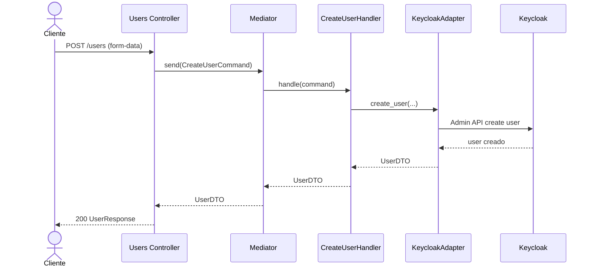
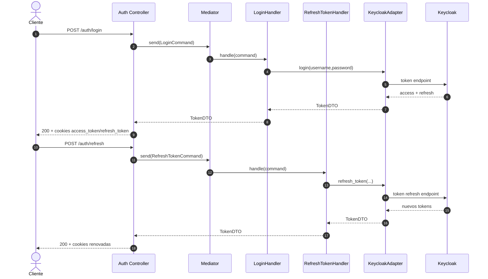

# Micro_Usuarios 🔐👤


Microservicio de usuarios y autenticacion para Netcom CCTV. Gestiona ciclo de vida de usuario y sesiones contra Keycloak, con bootstrap seguro desde Hashi Vault.

## Indice
- [Arquitectura](#-arquitectura)
- [Tecnologias Importantes](#-tecnologias-importantes)
- [Estructura de carpetas](#-estructura-de-carpetas)
- [Configuracion de entorno](#-configuracion-de-entorno)
- [Variables de entorno (Vault)](#-variables-de-entorno-vault)
- [Ejecutar servidor](#-ejecutar-servidor)
- [Ejecutar con Docker](#-ejecutar-con-docker)
- [Endpoints Reales](#-endpoints-reales)
- [Checklist rapido](#-checklist-rapido)
- [Testing y Coverage](#-testing-y-coverage)
- [Diagramas](#-diagramas)

## 🧱 Arquitectura
Arquitectura por capas:
- 🌐 API: endpoints y middleware HTTP.
- 🧠 Application: comandos, queries, handlers y DTOs.
- 🧩 Domain: entidades, enums y excepciones.
- 🔌 Infrastructure: Vault y adaptador de Keycloak.
- 🧪 Test: pruebas por capa con patron AAA (Arrange, Act, Assert).

## 🧰 Tecnologias Importantes
- 🐍 `Python 3.x`
- ⚡ `FastAPI 0.128.1`
- 🧾 `Pydantic 2.12.5`
- 🚀 `Uvicorn 0.40.0`
- 🔐 `hvac 2.4.0` (Vault)
- 🌐 `httpx 0.28.1` y `requests 2.32.5`
- 🧠 `mediatr 1.3.2`

## 🗂️ Estructura de carpetas
```text
Micro_Usuarios/
├── README.md
└── Micro_Users/
    ├── .env
    ├── .env.example
    ├── Users_API/
    │   ├── Controllers/
    │   ├── main.py
    │   ├── middleware.py
    │   └── program.py
    ├── Users_Application/
    │   ├── Commands/
    │   ├── DTOs/
    │   ├── Handlers/
    │   ├── Interfaces/
    │   ├── Mappers/
    │   └── Queries/
    ├── Users_Domain/
    │   ├── Entities/
    │   ├── Enums/
    │   └── Exceptions/
    ├── Users_Infrastruture/
    │   ├── Vault/
    │   └── keycloak_adapter.py
    ├── Users_Test/
    └── requirements.txt
```

## ⚙️ Configuracion de entorno
1. Ir al directorio del microservicio
```bash
cd Micro_Users
```
2. Crear entorno virtual
```bash
python -m venv venv
```
3. Activar entorno virtual  
Linux/macOS:
```bash
source venv/bin/activate
```
Windows (PowerShell):
```bash
venv\Scripts\Activate.ps1
```
4. Instalar dependencias
```bash
pip install -r requirements.txt
```

## 🔐 Variables de entorno (Vault)
Copia el ejemplo y completa bootstrap:
```bash
cp .env.example .env
```

Variables esperadas:
- `VAULT_ADDR`
- `ROLE_ID`
- `SECRET_ID`
- `VAULT_KV_MOUNT`
- `VAULT_KEYCLOAK_SECRET_PATH`

Secretos esperados en `VAULT_KEYCLOAK_SECRET_PATH`:
- `KEYCLOAK_URL`
- `KEYCLOAK_REALM`
- `KEYCLOAK_CLIENT_ID`
- `KEYCLOAK_CLIENT_SECRET`

## ▶️ Ejecutar servidor
Desde `Micro_Usuarios/Micro_Users`:
```bash
uvicorn Users_API.main:app --host 127.0.0.1 --port 8001 --reload
```

## 🐳 Ejecutar con Docker
Construir la imagen desde `Micro_Usuarios`:
```bash
docker build -t netcom-users-api .
```

Levantar el contenedor publicando el puerto `8001` y cargando el bootstrap de Vault:
```bash
docker run --rm \
  --name netcom-users-api \
  --env-file Micro_Users/.env \
  --add-host=host.docker.internal:host-gateway \
  -p 8001:8001 \
  netcom-users-api
```

Notas de runtime:
- Si `VAULT_ADDR` o `KEYCLOAK_URL` apuntan a `localhost` o `127.0.0.1`, dentro del contenedor se remapean automaticamente a `host.docker.internal`.
- En Linux, el flag `--add-host=host.docker.internal:host-gateway` es necesario para que el contenedor pueda alcanzar servicios que corren en el host.
- Si prefieres Docker Compose, usa la misma imagen, el mismo `env_file` y agrega `extra_hosts: ["host.docker.internal:host-gateway"]`.

Documentacion interactiva:
- Swagger UI: `http://127.0.0.1:8001/docs`
- ReDoc: `http://127.0.0.1:8001/redoc`

## 🌐 Endpoints Reales
| Metodo | Endpoint | Descripcion |
|---|---|---|
| `POST` | `/users` | Crear usuario |
| `PUT` | `/users/{user_id}` | Actualizar usuario |
| `GET` | `/users/{user_id}` | Consultar usuario |
| `POST` | `/auth/login` | Login y set de cookies seguras |
| `POST` | `/auth/refresh` | Renovar sesion por refresh token (body o cookie) |
| `POST` | `/auth/logout` | Cerrar sesion y limpiar cookies |
| `GET` | `/auth/validate` | Validar access token (header o cookie) |

Nota: actualmente no hay rutas TOTP expuestas en `Users_API/Controllers/controller.py`.

## ✅ Checklist rapido
- [ ] `.env` con bootstrap de Vault
- [ ] Variables en Vault para Keycloak
- [ ] Entorno virtual activo
- [ ] Dependencias instaladas
- [ ] Uvicorn en puerto correcto

## 🧪 Testing y Coverage
### Requisitos para ejecutar pruebas
- Python `3.x`
- Entorno virtual activo
- Dependencias instaladas con `pip install -r requirements.txt`
- Ubicarse en `Micro_Usuarios/Micro_Users`

### Como ejecutar los tests
Comando base (ya incluye coverage por `pytest.ini`):
```bash
pytest
```

### Reportes de coverage generados
Al ejecutar `pytest`, se generan automaticamente:
- Resumen en consola con lineas faltantes: `--cov-report=term-missing`
- Reporte XML para CI/CD: `coverage.xml`
- Reporte HTML navegable: `htmlcov/index.html`

### Cuadro explicativo de la suite de prueba
| Suite | Ubicacion | Que valida | Tipo de prueba |
|---|---|---|---|
| Controller | `Users_Test/Controller` | Endpoints, codigos HTTP, validacion de entradas y wiring con handlers/program | Unitaria de capa API (dependencias mockeadas) |
| Handlers | `Users_Test/Handlers` | Casos de uso de aplicacion (comandos/queries), reglas de negocio y mapeos DTO | Unitarias de capa Application |
| Keycloak Adapter | `Users_Test/KeycloackServiceTest` | Integracion del adaptador con llamadas a Keycloak (login, refresh, create/update user) mediante mocks | Unitarias con dependencias externas mockeadas |

### Convencion de pruebas (AAA)
Todas las pruebas del proyecto siguen el patron AAA:
- Arrange: preparacion de datos, mocks y doubles (`monkeypatch`, fakes, fixtures).
- Act: ejecucion de una sola accion del SUT (handler, endpoint o metodo del adaptador).
- Assert: validacion de resultado, excepcion o efecto esperado.

Regla aplicada en este repositorio:
- No se consumen servicios externos reales en tests (Keycloak/Vault/red); todo se simula con mocks/fakes para mantener pruebas unitarias.

### Inventario de pruebas (Nombre, Ubicacion, Descripcion)
| Nombre | Ubicacion | Descripcion |
|---|---|---|
| `test_controller.py` | `Micro_Usuarios/Micro_Users/Users_Test/Controller/test_controller.py` | Pruebas unitarias de endpoints `/users` y `/auth` con `TestClient`, mediador y adaptador mockeados. |
| `test_program_vault_config.py` | `Micro_Usuarios/Micro_Users/Users_Test/Controller/test_program_vault_config.py` | Verifica carga de configuracion de Keycloak desde Vault y errores esperados cuando falta configuracion o no hay respuesta. |
| `test_handlers.py` | `Micro_Usuarios/Micro_Users/Users_Test/Handlers/test_handlers.py` | Valida handlers de comandos/queries: crear, actualizar, login, refresh y consulta de usuario con servicio fake. |
| `test_keycloak_adapter.py` | `Micro_Usuarios/Micro_Users/Users_Test/KeycloackServiceTest/test_keycloak_adapter.py` | Prueba el adaptador de Keycloak aislado con `requests` mockeado: token admin, create/update/find, login/refresh, validate y asignacion de rol. |

Cobertura objetivo del proyecto:
- `Users_API`
- `Users_Application`
- `Users_Domain`
- `Users_Infrastruture`

## 🧩 Diagramas
### 1) Secuencia - Registro de usuario (`POST /users`)


### 2) Secuencia - Login y refresh


### 3) Secuencia - Bootstrap de app con Vault

