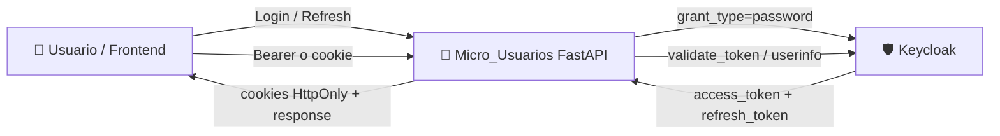

# Micro_Usuarios 🔐👤


---

## 🎯 Resumen Ejecutivo
Microservicio responsable de la **gestión de usuarios y autenticación** de la plataforma Netcom CCTV.

### 💼 Valor de negocio
- Centraliza identidad y acceso en un único servicio.
- Reduce riesgos de seguridad al delegar autenticación en Keycloak.
- Permite escalar clientes (web/móvil) con flujo OAuth2/OIDC estándar.

---

## 🏗️ Arquitectura Técnica

### 🔄 Flujo de datos (Mermaid)


### 🧰 Stack tecnológico
- **API:** FastAPI + Uvicorn
- **Validación:** Pydantic v2
- **Auth/IdP:** Keycloak (OpenID Connect/OAuth2)
- **HTTP cliente externo:** `requests`
- **Infra local de soporte:** Docker Compose en `Apigateway` (Keycloak + Vault + Nginx)

---

## ⚙️ Configuración y Variables de Entorno

Archivo base: `Micro_Usuarios/Micro_Users/.env` (copiar desde `.env.example`).

### 🏠 Variables locales de configuración
| Variable | Requerida | Ejemplo | Uso |
|---|---|---|---|
| `KEYCLOAK_URL` | ✅ | `http://127.0.0.1:8080` | URL base de Keycloak |
| `KEYCLOAK_REALM` | ✅ | `netcom` | Realm de autenticación |
| `KEYCLOAK_CLIENT_ID` | ✅ | `netcom-backend` | Cliente OAuth2/OIDC |
| `AUTH_COOKIE_SAMESITE` | ❌ | `none` | Política SameSite de cookies |

### 🔐 Secretos (inyectados por Vault o runtime seguro)
| Variable / Secreto | Fuente | Requerida | Notas |
|---|---|---|---|
| `KEYCLOAK_CLIENT_SECRET` | Secret manager / runtime | ✅ | No subir a git |
| `KEYCLOAK_ADMIN` | Vault (infra) | ⚠️* | Usado por contenedor Keycloak |
| `KEYCLOAK_ADMIN_PASSWORD` | Vault (infra) | ⚠️* | Usado por contenedor Keycloak |
| `KC_DB_USERNAME` | Vault (infra) | ⚠️* | Inyectado por script de gateway |
| `KC_DB_PASSWORD` | Vault (infra) | ⚠️* | Inyectado por script de gateway |

> 
> *⚠️ Aplica cuando levantas Keycloak con `Apigateway/scripts/up_with_vault_secrets.sh`.*

---

## 🛡️ Seguridad

### 🔐 Flujo de autenticación con Keycloak
1. `POST /auth/login` recibe `username` y `password`.
2. El servicio solicita token a Keycloak (`grant_type=password`).
3. Devuelve `access_token` y configura cookies `HttpOnly` (`access_token` y `refresh_token`).
4. `POST /auth/refresh` renueva sesión con `refresh_token`.
5. `GET /auth/validate` valida token vía `userinfo` o `introspect` en Keycloak.

### 🍪 Cookies y hardening actual
- Cookies con `httponly=true` y `secure=true`.
- `SameSite` configurable por entorno (`AUTH_COOKIE_SAMESITE`).
- Logout limpia `access_token`, `refresh_token` y `authToken`.

### 🧱 Gestión de Unseal de Vault (infra local)
Para la infraestructura local (Vault en `Apigateway`) se usa unseal manual:

```bash
# Inicializar (solo primera vez)
docker exec -it netcom-vault vault operator init

# Unseal con llaves
docker exec -it netcom-vault vault operator unseal <UNSEAL_KEY_1>
docker exec -it netcom-vault vault operator unseal <UNSEAL_KEY_2>
docker exec -it netcom-vault vault operator unseal <UNSEAL_KEY_3>

# Login con root token
docker exec -it netcom-vault vault login <ROOT_TOKEN>
```

---

## 🚀 Guía de Despliegue Local

### ✅ Requisitos para levantar el microservicio
- Python 3.x
- Docker + Docker Compose (si usarás Keycloak/Vault locales)
- Realm y cliente configurados en Keycloak

### 1) Levantar infraestructura de autenticación (recomendado)
Desde `Netcom_CCTV/Apigateway`:

```bash
cd /home/usuario-ingenieria/Desktop/Netcom_CCTV/Apigateway
cp .env.example .env
docker compose up -d
```

Si deseas inyección de secretos desde Vault al arrancar:

```bash
cd /home/usuario-ingenieria/Desktop/Netcom_CCTV/Apigateway
export VAULT_TOKEN="<tu_token_vault>"
./scripts/up_with_vault_secrets.sh
```

### 2) Levantar Micro_Usuarios
Desde `Netcom_CCTV/Micro_Usuarios/Micro_Users`:

```bash
cd /home/usuario-ingenieria/Desktop/Netcom_CCTV/Micro_Usuarios/Micro_Users
cp .env.example .env
python -m venv venv
source venv/bin/activate
pip install -r requirements.txt
uvicorn Users_API.main:app --host 127.0.0.1 --port 8001 --reload
```

Documentación interactiva:
- Swagger: http://127.0.0.1:8001/docs
- ReDoc: http://127.0.0.1:8001/redoc

---

## 🧭 Endpoints de API (principales)
Base local directa: `http://127.0.0.1:8001`  
Vía gateway: `https://localhost/users`

### 👤 Usuarios
| Método | Ruta | Descripción |
|---|---|---|
| `POST` | `/users` | Crear usuario |
| `PUT` | `/users/{user_id}` | Actualizar usuario |
| `GET` | `/users/{user_id}` | Consultar usuario |

**Ejemplo Request (`POST /users`, form-data):**
```text
password=Secret123!
email=operador@netcom.local
first_name=Juan
last_name=Perez
cedula=12345678
rol=admin
```

**Ejemplo Response (200):**
```json
{
	"id": "6a8d5d1b-0c22-4d88-9d6e-beb7b7dd2a10",
	"username": "operador@netcom.local",
	"email": "operador@netcom.local",
	"first_name": "Juan",
	"last_name": "Perez",
	"rol": "admin",
	"attributes": {
		"cedula": ["12345678"]
	}
}
```

### 🔐 Auth
| Método | Ruta | Descripción |
|---|---|---|
| `POST` | `/auth/login` | Login y set de cookies seguras |
| `POST` | `/auth/refresh` | Renovar sesión |
| `POST` | `/auth/logout` | Cerrar sesión |
| `GET` | `/auth/validate` | Validar token |

**Ejemplo Request (`POST /auth/login`):**
```json
{
	"username": "operador@netcom.local",
	"password": "Secret123!"
}
```

**Ejemplo Response (`POST /auth/login`):**
```json
{
	"detail": "Login successful",
	"access_token": "<jwt>"
}
```

---

## 🛠️ Mantenimiento

### 💾 Estrategia de backups
Este microservicio no persiste usuarios en base local: la fuente de verdad es Keycloak + su BD.

Backups recomendados:
- **Realm export** periódico (configuración, clientes, roles):

```bash
# Ejecutar dentro de contenedor Keycloak si aplica a tu setup
docker exec -it netcom-keycloak /opt/keycloak/bin/kc.sh export --dir /opt/keycloak/data/export --realm <tu_realm>
```

- **Backup de la BD de Keycloak** (en host Postgres):

```bash
PGPASSWORD="<password>" pg_dump -h localhost -U keycloak -d keycloak -F c -f backup_keycloak_$(date +%F).dump
```

### 🧾 Logs
```bash
# Micro_Usuarios (si corres uvicorn local)
# redirige salida a archivo o usa supervisión del sistema

# Infra en docker
docker logs -f netcom-keycloak
docker logs -f netcom-nginx-gateway
docker logs -f netcom-vault
```

---

## ✅ Checklist rápido de arranque local
- [ ] Vault inicializado y en estado unsealed (si aplica)
- [ ] Keycloak arriba y realm disponible
- [ ] `.env` de `Micro_Users` completo
- [ ] Entorno virtual activo y dependencias instaladas
- [ ] Servicio respondiendo en `http://127.0.0.1:8001/docs`
