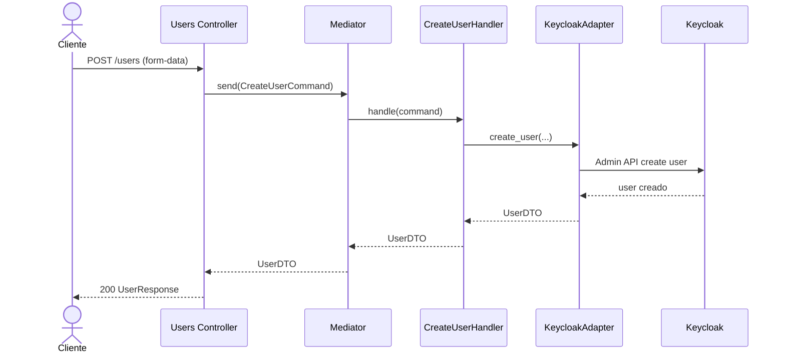
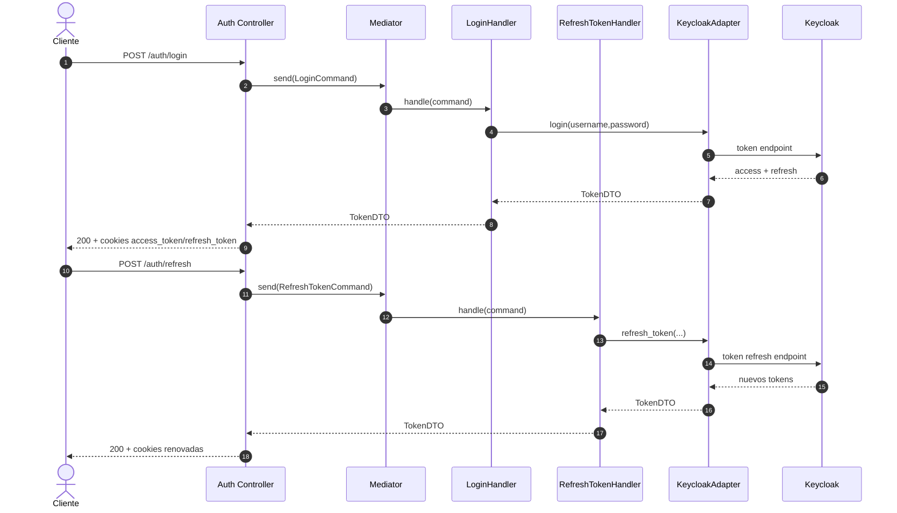
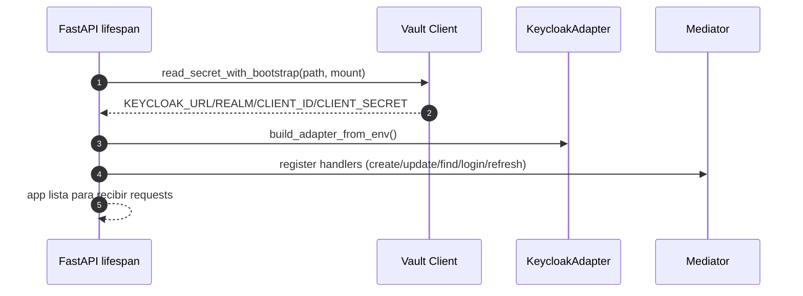

# Micro_Usuarios 🔐👤


Microservicio de usuarios y autenticacion para Netcom CCTV. Gestiona ciclo de vida de usuario y sesiones contra Keycloak, con bootstrap seguro desde Hashi Vault.

## 🧱 Arquitectura
Arquitectura por capas:
- 🌐 API: endpoints y middleware HTTP.
- 🧠 Application: comandos, queries, handlers y DTOs.
- 🧩 Domain: entidades, enums y excepciones.
- 🔌 Infrastructure: Vault y adaptador de Keycloak.
- 🧪 Test: pruebas por capa.

## 🧰 Tecnologias Importantes
- 🐍 `Python 3.x`
- ⚡ `FastAPI 0.128.1`
- 🧾 `Pydantic 2.12.5`
- 🚀 `Uvicorn 0.40.0`
- 🔐 `hvac 2.4.0` (Vault)
- 🌐 `httpx 0.28.1` y `requests 2.32.5`
- 🧠 `mediatr 1.3.2`

## 🗂️ Estructura de carpetas
```text
Micro_Usuarios/
├── README.md
└── Micro_Users/
    ├── .env
    ├── .env.example
    ├── Users_API/
    │   ├── Controllers/
    │   ├── main.py
    │   ├── middleware.py
    │   └── program.py
    ├── Users_Application/
    │   ├── Commands/
    │   ├── DTOs/
    │   ├── Handlers/
    │   ├── Interfaces/
    │   ├── Mappers/
    │   └── Queries/
    ├── Users_Domain/
    │   ├── Entities/
    │   ├── Enums/
    │   └── Exceptions/
    ├── Users_Infrastruture/
    │   ├── Vault/
    │   └── keycloak_adapter.py
    ├── Users_Test/
    └── requirements.txt
```

## ⚙️ Configuracion de entorno
1. Crear entorno virtual
```bash
python -m venv venv
```
2. Activar entorno virtual
Linux/macOS:
```bash
source venv/bin/activate
```
Windows (PowerShell):
```bash
venv\Scripts\Activate.ps1
```
3. Instalar dependencias
```bash
pip install -r requirements.txt
```

## 🔐 Variables de entorno (Vault)
Copia el ejemplo y completa bootstrap:
```bash
cp .env.example .env
```

Variables esperadas:
- `VAULT_ADDR`
- `ROLE_ID`
- `SECRET_ID`
- `VAULT_KV_MOUNT`
- `VAULT_KEYCLOAK_SECRET_PATH`

Secretos esperados en `VAULT_KEYCLOAK_SECRET_PATH`:
- `KEYCLOAK_URL`
- `KEYCLOAK_REALM`
- `KEYCLOAK_CLIENT_ID`
- `KEYCLOAK_CLIENT_SECRET`

## ▶️ Ejecutar servidor
Desde `Micro_Usuarios/Micro_Users`:
```bash
uvicorn Users_API.main:app --host 127.0.0.1 --port 8001 --reload
```

Documentacion interactiva:
- Swagger UI: `http://127.0.0.1:8001/docs`
- ReDoc: `http://127.0.0.1:8001/redoc`

## 🌐 Endpoints Reales
| Metodo | Endpoint | Descripcion |
|---|---|---|
| `POST` | `/users` | Crear usuario |
| `PUT` | `/users/{user_id}` | Actualizar usuario |
| `GET` | `/users/{user_id}` | Consultar usuario |
| `POST` | `/auth/login` | Login y set de cookies seguras |
| `POST` | `/auth/refresh` | Renovar sesion por refresh token (body o cookie) |
| `POST` | `/auth/logout` | Cerrar sesion y limpiar cookies |
| `GET` | `/auth/validate` | Validar access token (header o cookie) |

Nota: actualmente no hay rutas TOTP expuestas en `Users_API/Controllers/controller.py`.

## ✅ Checklist rapido
- [ ] `.env` con bootstrap de Vault
- [ ] Variables en Vault para Keycloak
- [ ] Entorno virtual activo
- [ ] Dependencias instaladas
- [ ] Uvicorn en puerto correcto

## 🧩 Diagramas
### 1) Secuencia - Registro de usuario (`POST /users`)


### 2) Secuencia - Login y refresh


### 3) Secuencia - Bootstrap de app con Vault

